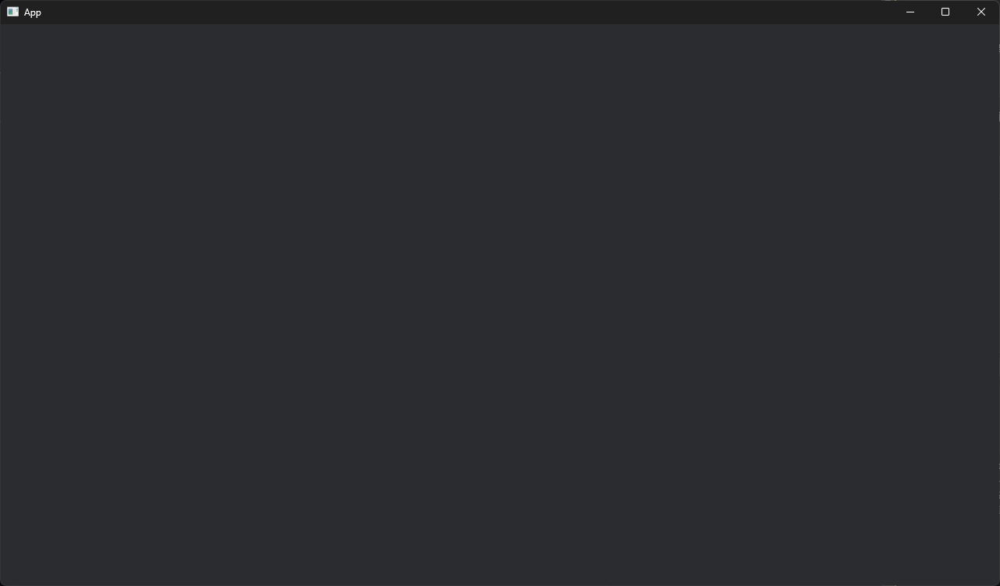
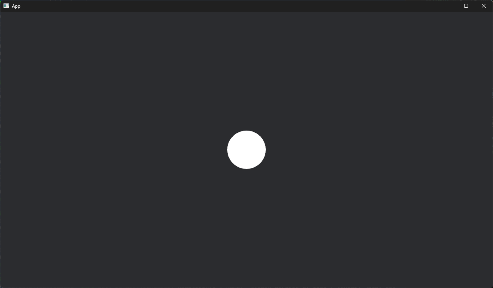
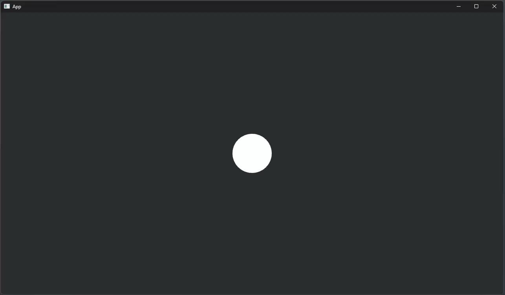

# WASD controller

## 開発環境

```
rustc 1.85.0
bevy 0.15.3
```


## 初期設定

``` cargo ``` で新しいプロジェクトを作成する。

```shell
$ cargo new wasd
$ cd wasd
```

``` Cargo.toml ``` に追記する。

```toml
[package]
name = "wasd-controller"
version = "0.1.0"
edition = "2021"

[dependencies]
bevy = { version = "0.15.3", features = ["dynamic_linking"] }
# Use instead for release build
# bevy = 0.15.3

# Enable small optimizations for local code
[profile.dev]
opt-level = 1

# Enable high optimizations for dependencies
[profile.dev.package."*"]
opt-level = 3
```

``` main.rs ``` 次のように書き換える。

```rust
use bevy::prelude::*;

fn main() {
    App::new()
        .add_plugins(DefaultPlugins)
        .run();
}
```

この状態で一旦ビルドし実行する。初回ビルドのため、依存関係を全てビルドするため時間がかかる。

```shell
cargo run
```

何も表示されないウィンドウが現れれば、初期設定が完了。




## 画面表示

main関数にプログラム実行時に動作するsystemを追記する。

```rust
fn main() {
    App::new()
        .add_plugins(DefaultPlugins)
        .add_systems(Startup, setup)  // 追記
        .run();
}
```

自機（Player）のcomponentを宣言する。


```rust
#[derive(Component)]
struct Player;
```

加えて、``` setup ```　関数を定義する。

```rust
fn setup(
    mut commands: Commands,
    mut materials: ResMut<Assets<ColorMaterial>>,
    mut meshes: ResMut<Assets<Mesh>>
) {
    commands.spawn(Camera2d);
    commands.spawn((
        Player,
        Mesh2d(meshes.add(Circle::new(50.))),
        MeshMaterial2d(materials.add(Color::WHITE)),
    ));
}
```

この状態で ビルド・実行すると、中央にPlayer componentである白い円が描画される。




## キーボード入力で移動

``` Player ```をキーボードのWASDキーで移動させる。

```rust
const PLAYER_SPEED: f32 = 300.;
fn move_player(
    mut player: Query<&mut Transform, With<Player>>,
    time: Res<Time>,
    kb_input: Res<ButtonInput<KeyCode>>,
) {
    let Ok(mut player) = player.get_single_mut() else {
        return;
    };

    let mut direction = Vec2::ZERO;
    if kb_input.pressed(KeyCode::KeyW) {
        direction.y += 1.;
    }
    if kb_input.pressed(KeyCode::KeyS) {
        direction.y -= 1.;
    }
    if kb_input.pressed(KeyCode::KeyA) {
        direction.x -= 1.;
    }
    if kb_input.pressed(KeyCode::KeyD) {
        direction.x += 1.;
    }

    let move_delta = direction.normalize_or_zero() * PLAYER_SPEED * time.delta_secs();
    player.translation += move_delta.extend(0.);  // Vec2 -> Vec3
}
```

```rust
fn main() {
    App::new()
        .add_plugins(DefaultPlugins)
        .add_systems(Startup, setup)
        .add_systems(Update, move_player)  // 追記
        .run();
}
```


